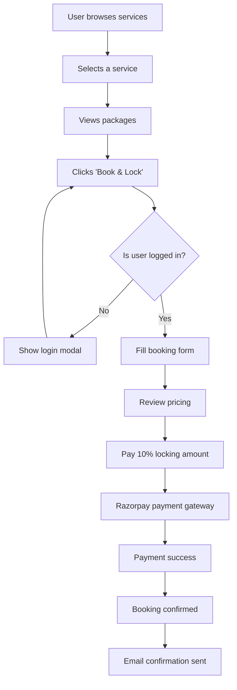
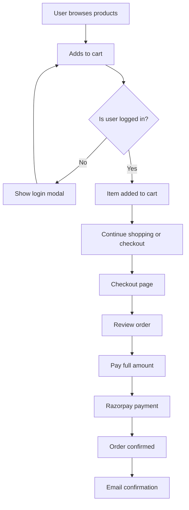
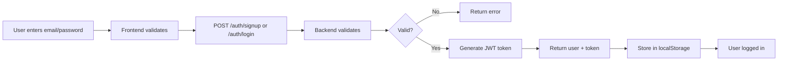
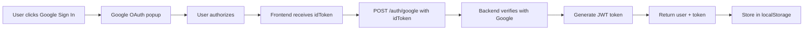
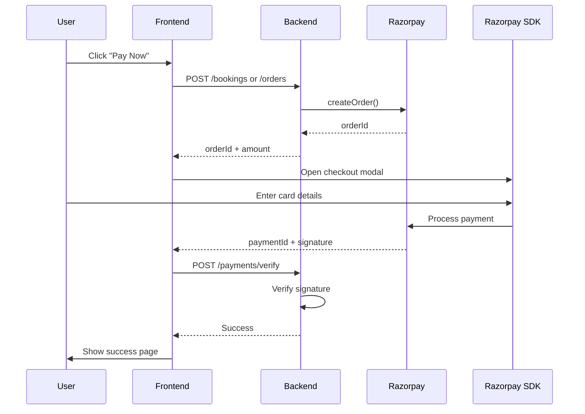

# AnandAyojan - Complete Project Documentation

## 📚 Table of Contents
1. [Project Overview](#project-overview)
2. [Technologies Used](#technologies-used)
3. [How Things Work](#how-things-work)
4. [Frontend & Backend Connection](#frontend--backend-connection)
5. [Environment Setup](#environment-setup)
6. [Running the Application](#running-the-application)
7. [Future Database Integration](#future-database-integration)
8. [Authentication Flow](#authentication-flow)
9. [Payment Flow](#payment-flow)
10. [Troubleshooting](#troubleshooting)

---

## 🎯 Project Overview

AnandAyojan is a full-stack wedding and event services booking platform built for the Indian market. It allows users to:
- Browse 8 different event services (Mehndi, Dhol, Decoration, Pandit, Makeup, Photography, Helper, Shopping)
- Book services by paying just 10% upfront (locking amount)
- Shop for wedding products with a full e-commerce flow
- Manage bookings and orders
- Cancel with 100% refund if done ≥6 hours before scheduled time

**Current Status**: Frontend is complete. Backend is ready for integration with your credentials.

---

## 🛠 Technologies Used

### Frontend (Client-Side)
- **React 18**: Modern UI library
- **TypeScript**: Type-safe JavaScript
- **Vite**: Fast build tool
- **Tailwind CSS**: Utility-first CSS framework
- **shadcn/ui**: Beautiful pre-built components
- **React Router v6**: Client-side routing
- **React Hook Form**: Form handling
- **Zod**: Schema validation
- **TanStack Query**: Data fetching
- **Lucide React**: Icon library

### Backend (Server-Side)
- **Node.js + Express**: Server framework
- **TypeScript**: Type-safe server code
- **JWT**: Authentication tokens
- **bcrypt**: Password hashing
- **Razorpay**: Payment gateway
- **SendGrid**: Email service

### External Integrations
- **Razorpay**: For payment processing
- **Google OAuth**: For social login
- **SendGrid**: For transactional emails

---

## 🔧 How Things Work

### 1. **Service Booking Flow**



**Key Components**:
- `src/pages/ServiceDetail.tsx` - Service details and packages
- `src/components/BookingForm.tsx` - Booking form with validation
- `server/src/routes/bookings.ts` - Backend booking API
- `server/src/services/razorpay.ts` - Payment processing

### 2. **E-commerce (Product Shopping) Flow**



**Key Components**:
- `src/pages/Products.tsx` - Product listing
- `src/pages/ProductDetail.tsx` - Product details
- `src/contexts/CartContext.tsx` - Cart state management
- `src/pages/Checkout.tsx` - Checkout flow
- `server/src/routes/orders.ts` - Backend order API

### 3. **Authentication Flow**

**Two Methods Supported**:

#### A. Email + Password


#### B. Google OAuth


**Key Files**:
- `src/contexts/AuthContext.tsx` - Auth state management
- `src/pages/Auth.tsx` - Login/Signup page
- `src/components/EmailAuth.tsx` - Email/password form
- `src/components/GoogleSignIn.tsx` - Google OAuth button
- `server/src/routes/auth.ts` - Auth endpoints
- `server/src/middleware/auth.ts` - JWT verification

### 4. **Payment Flow (Razorpay)**



**Key Files**:
- `src/lib/payment.ts` - Razorpay SDK initialization
- `server/src/services/razorpay.ts` - Razorpay server logic
- `server/src/routes/payments.ts` - Payment verification

---

## 🔗 Frontend & Backend Connection

### How Frontend Talks to Backend

**1. Base URL Configuration**
```typescript
// src/services/api.ts
const API_BASE_URL = import.meta.env.VITE_API_BASE_URL || 'http://localhost:3001';
```

**2. API Client with Authentication**
```typescript
// Every request automatically includes JWT token from localStorage
const apiClient = async (endpoint: string, options: RequestInit = {}) => {
  const token = localStorage.getItem('aa_token');
  
  const headers = {
    'Content-Type': 'application/json',
    ...(token && { 'Authorization': `Bearer ${token}` })
  };
  
  const response = await fetch(`${API_BASE_URL}${endpoint}`, { ...options, headers });
  return await response.json();
};
```

**3. Available API Endpoints**

| Endpoint | Method | Auth Required | Purpose |
|----------|--------|---------------|---------|
| `/auth/signup` | POST | No | Create new account |
| `/auth/login` | POST | No | Login with email/password |
| `/auth/google` | POST | No | Login with Google |
| `/bookings` | POST | Yes | Create new booking |
| `/bookings` | GET | Yes | Get user's bookings |
| `/bookings/:id/cancel` | POST | Yes | Cancel a booking |
| `/orders` | POST | Yes | Create new order |
| `/orders` | GET | Yes | Get user's orders |
| `/payments/verify` | POST | Yes | Verify Razorpay payment |

**4. Request/Response Examples**

**Signup**:
```typescript
POST /auth/signup
Body: { email: "user@example.com", password: "pass123", name: "John Doe" }
Response: { user: {...}, token: "jwt_token_here" }
```

**Create Booking**:
```typescript
POST /bookings
Headers: { Authorization: "Bearer <token>" }
Body: {
  serviceId: "mehndi",
  packageId: "premium",
  name: "John",
  email: "john@example.com",
  phone: "+919876543210",
  preferredDate: "2025-01-15",
  preferredTime: "14:00",
  city: "Mumbai",
  pincode: "400001"
}
Response: { booking: {...}, razorpayOrderId: "order_xyz" }
```

---

## ⚙️ Environment Setup

### Required Environment Variables

#### **Frontend (.env in root folder)**
```bash
# API Configuration
VITE_API_BASE_URL=http://localhost:3001

# Google OAuth (Optional)
VITE_GOOGLE_CLIENT_ID=your_google_client_id_here

# Razorpay (Required for payments)
VITE_RAZORPAY_KEY_ID=rzp_test_xxxxxxxxxxxx
```

#### **Backend (server/.env)**
```bash
# Server Configuration
PORT=3001
FRONTEND_BASE_URL=http://localhost:8080

# JWT Secret (change in production!)
JWT_SECRET=your_super_secret_jwt_key_change_this_in_production

# Google OAuth (Optional)
GOOGLE_CLIENT_ID=your_google_client_id
GOOGLE_CLIENT_SECRET=your_google_client_secret

# Razorpay (Required)
RAZORPAY_KEY_ID=rzp_test_xxxxxxxxxxxx
RAZORPAY_KEY_SECRET=your_razorpay_key_secret
RAZORPAY_WEBHOOK_SECRET=your_webhook_secret

# SendGrid Email (Optional but recommended)
SENDGRID_API_KEY=SG.xxxxxxxxxxxxxxxxx
SENDGRID_FROM_EMAIL=noreply@anandayojan.com
```

### How to Get These Credentials

**1. Razorpay** (Required):
- Go to https://dashboard.razorpay.com/
- Sign up for an account
- Navigate to Settings → API Keys
- Generate test keys for development
- Copy `Key ID` to `VITE_RAZORPAY_KEY_ID` (frontend) and `RAZORPAY_KEY_ID` (backend)
- Copy `Key Secret` to `RAZORPAY_KEY_SECRET` (backend only)

**2. Google OAuth** (Optional):
- Go to https://console.cloud.google.com/
- Create a new project
- Enable Google+ API
- Create OAuth 2.0 credentials
- Add authorized origins: `http://localhost:8080`
- Add authorized redirect URIs: `http://localhost:8080`
- Copy `Client ID` to both frontend and backend

**3. SendGrid** (Optional):
- Go to https://sendgrid.com/
- Sign up for free account
- Navigate to Settings → API Keys
- Create new API key with "Mail Send" permission
- Copy to `SENDGRID_API_KEY`
- Verify a sender email address for `SENDGRID_FROM_EMAIL`

---

## 🚀 Running the Application

### Prerequisites
- Node.js 18 or higher
- npm or yarn package manager

### Step 1: Clone & Install Dependencies

```bash
# Clone the repository
git clone <your-repo-url>
cd anandayojan

# Install frontend dependencies
npm install

# Install backend dependencies
cd server
npm install
cd ..
```

### Step 2: Configure Environment Variables

```bash
# Copy environment templates
cp .env.example .env
cp server/.env.example server/.env

# Edit the files and add your credentials
# Use a text editor to fill in the values
```

### Step 3: Start the Backend Server

```bash
# From the root directory
cd server
npm run dev
```

You should see:
```
Server running on http://localhost:3001
```

### Step 4: Start the Frontend (In a new terminal)

```bash
# From the root directory (not inside server/)
npm run dev
```

You should see:
```
  VITE v5.x.x  ready in xxx ms

  ➜  Local:   http://localhost:8080/
  ➜  Network: use --host to expose
```

### Step 5: Open in Browser

Navigate to `http://localhost:8080`

---

## 🗄️ Future Database Integration

Currently, the backend uses **in-memory storage** (data stored in JavaScript variables). This means data is lost when the server restarts. For production, you need a real database.

### Recommended Database: PostgreSQL

#### Why PostgreSQL?
- ✅ Robust and reliable
- ✅ Excellent for relational data (users, bookings, orders)
- ✅ Free and open-source
- ✅ Well-supported by hosting platforms

### Step-by-Step Database Setup Guide

#### Option A: Using Supabase (Easiest - Recommended for Beginners)

**1. Create Supabase Project**
```bash
# Go to https://supabase.com/
# Click "New Project"
# Note down your database URL and API keys
```

**2. Install Supabase Client**
```bash
npm install @supabase/supabase-js
```

**3. Configure Connection**
```typescript
// server/src/config/database.ts
import { createClient } from '@supabase/supabase-js';

const supabaseUrl = process.env.SUPABASE_URL!;
const supabaseKey = process.env.SUPABASE_ANON_KEY!;

export const supabase = createClient(supabaseUrl, supabaseKey);
```

**4. Create Tables**
```sql
-- Run this in Supabase SQL Editor

-- Users table
CREATE TABLE users (
  id UUID PRIMARY KEY DEFAULT uuid_generate_v4(),
  email VARCHAR(255) UNIQUE NOT NULL,
  password_hash VARCHAR(255),
  name VARCHAR(255) NOT NULL,
  phone VARCHAR(20),
  created_at TIMESTAMP DEFAULT NOW()
);

-- Bookings table
CREATE TABLE bookings (
  id UUID PRIMARY KEY DEFAULT uuid_generate_v4(),
  user_id UUID REFERENCES users(id),
  service_id VARCHAR(50) NOT NULL,
  service_name VARCHAR(255) NOT NULL,
  package_id VARCHAR(50) NOT NULL,
  package_name VARCHAR(255) NOT NULL,
  name VARCHAR(255) NOT NULL,
  email VARCHAR(255) NOT NULL,
  phone VARCHAR(20) NOT NULL,
  address TEXT,
  city VARCHAR(100) NOT NULL,
  pincode VARCHAR(10) NOT NULL,
  preferred_date DATE NOT NULL,
  preferred_time TIME NOT NULL,
  estimated_guests INTEGER,
  notes TEXT,
  total_amount DECIMAL(10,2) NOT NULL,
  locking_amount DECIMAL(10,2) NOT NULL,
  status VARCHAR(20) DEFAULT 'locked',
  payment_status VARCHAR(20) DEFAULT 'pending',
  refund_status VARCHAR(20),
  created_at TIMESTAMP DEFAULT NOW(),
  scheduled_at TIMESTAMP,
  cancelled_at TIMESTAMP,
  completed_at TIMESTAMP
);

-- Orders table
CREATE TABLE orders (
  id UUID PRIMARY KEY DEFAULT uuid_generate_v4(),
  user_id UUID REFERENCES users(id),
  items JSONB NOT NULL,
  total_amount DECIMAL(10,2) NOT NULL,
  status VARCHAR(20) DEFAULT 'pending',
  payment_status VARCHAR(20) DEFAULT 'pending',
  shipping_address TEXT NOT NULL,
  created_at TIMESTAMP DEFAULT NOW()
);

-- Create indexes for performance
CREATE INDEX idx_bookings_user_id ON bookings(user_id);
CREATE INDEX idx_bookings_email ON bookings(email);
CREATE INDEX idx_orders_user_id ON orders(user_id);
```

**5. Update Your Code to Use Database**

Replace in-memory storage with database queries:

```typescript
// Before (in-memory):
const bookings: Booking[] = [];
bookings.push(newBooking);

// After (with Supabase):
const { data, error } = await supabase
  .from('bookings')
  .insert(newBooking);
```

#### Option B: Using PostgreSQL Directly

**1. Install PostgreSQL**
```bash
# Mac (using Homebrew)
brew install postgresql
brew services start postgresql

# Ubuntu
sudo apt-get install postgresql
sudo systemctl start postgresql

# Windows
# Download from https://www.postgresql.org/download/windows/
```

**2. Install pg Library**
```bash
cd server
npm install pg
npm install --save-dev @types/pg
```

**3. Create Database Connection**
```typescript
// server/src/config/database.ts
import { Pool } from 'pg';

export const pool = new Pool({
  host: process.env.DB_HOST || 'localhost',
  port: parseInt(process.env.DB_PORT || '5432'),
  database: process.env.DB_NAME || 'anandayojan',
  user: process.env.DB_USER || 'postgres',
  password: process.env.DB_PASSWORD,
});
```

**4. Add to .env**
```bash
DB_HOST=localhost
DB_PORT=5432
DB_NAME=anandayojan
DB_USER=postgres
DB_PASSWORD=your_password
```

**5. Use in Your Routes**
```typescript
// server/src/routes/bookings.ts
import { pool } from '../config/database';

router.post('/bookings', async (req, res) => {
  const result = await pool.query(
    'INSERT INTO bookings (user_id, service_id, ...) VALUES ($1, $2, ...)',
    [userId, serviceId, ...]
  );
  res.json(result.rows[0]);
});
```

---

## 🔐 Authentication Flow (Detailed)

### How Login Works

**1. User Enters Credentials**
```typescript
// src/pages/Auth.tsx or src/components/EmailAuth.tsx
const handleLogin = async (email, password) => {
  const response = await authApi.emailLogin(email, password);
  // response = { user: {...}, token: "jwt_token" }
};
```

**2. Frontend Sends to Backend**
```typescript
// src/services/api.ts
export const authApi = {
  emailLogin: async (email: string, password: string) => {
    return apiClient('/auth/login', {
      method: 'POST',
      body: JSON.stringify({ email, password }),
    });
  }
};
```

**3. Backend Validates**
```typescript
// server/src/routes/auth.ts
router.post('/auth/login', async (req, res) => {
  const { email, password } = req.body;
  
  // Find user in database
  const user = await findUserByEmail(email);
  if (!user) return res.status(401).json({ error: 'Invalid credentials' });
  
  // Check password
  const isValid = await bcrypt.compare(password, user.password_hash);
  if (!isValid) return res.status(401).json({ error: 'Invalid credentials' });
  
  // Generate JWT token
  const token = jwt.sign(
    { id: user.id, email: user.email, name: user.name },
    process.env.JWT_SECRET!,
    { expiresIn: '7d' }
  );
  
  res.json({ user, token });
});
```

**4. Frontend Stores Token**
```typescript
// src/contexts/AuthContext.tsx
const googleLogin = async (idToken: string) => {
  const response = await authApi.googleLogin(idToken);
  
  // Store in state
  setUser(response.user);
  setToken(response.token);
  
  // Store in localStorage for persistence
  localStorage.setItem('aa_user', JSON.stringify(response.user));
  localStorage.setItem('aa_token', response.token);
};
```

**5. Using Token for Protected Requests**
```typescript
// src/services/api.ts - Automatically adds token to all requests
const apiClient = async (endpoint: string, options: RequestInit = {}) => {
  const token = localStorage.getItem('aa_token');
  
  const headers: HeadersInit = {
    'Content-Type': 'application/json',
    ...options.headers,
  };

  if (token) {
    headers['Authorization'] = `Bearer ${token}`;
  }
  
  // Makes request with token
  const response = await fetch(`${API_BASE_URL}${endpoint}`, { ...options, headers });
};
```

**6. Backend Verifies Token**
```typescript
// server/src/middleware/auth.ts
export const authenticateToken = (req: AuthRequest, res: Response, next: NextFunction) => {
  const authHeader = req.headers['authorization'];
  const token = authHeader && authHeader.split(' ')[1]; // "Bearer TOKEN"

  if (!token) {
    return res.status(401).json({ error: 'Authentication required' });
  }

  try {
    const decoded = jwt.verify(token, process.env.JWT_SECRET!);
    req.user = decoded; // Attach user info to request
    next(); // Allow request to proceed
  } catch (error) {
    return res.status(403).json({ error: 'Invalid or expired token' });
  }
};
```

---

## 💳 Payment Flow (Detailed)

### Razorpay Integration Steps

**1. User Initiates Payment**
```typescript
// src/pages/Checkout.tsx
const handlePayment = async () => {
  // Create order/booking first
  const response = await bookingsApi.create(bookingData);
  // response contains: { booking, razorpayOrderId, amount }
  
  // Initialize Razorpay
  await initiateRazorpayPayment(
    response.razorpayOrderId,
    response.amount,
    handlePaymentSuccess
  );
};
```

**2. Create Razorpay Order (Backend)**
```typescript
// server/src/services/razorpay.ts
export const createRazorpayOrder = async (amount: number, bookingId: string) => {
  const order = await razorpayInstance.orders.create({
    amount: amount * 100, // Convert to paise
    currency: 'INR',
    receipt: bookingId,
    notes: { bookingId }
  });
  
  return order;
};
```

**3. Open Razorpay Checkout (Frontend)**
```typescript
// src/lib/payment.ts
export const initiateRazorpayPayment = async (
  orderId: string,
  amount: number,
  onSuccess: (paymentData) => void
) => {
  const options = {
    key: import.meta.env.VITE_RAZORPAY_KEY_ID,
    amount: amount * 100,
    currency: 'INR',
    order_id: orderId,
    name: 'AnandAyojan',
    description: 'Service Booking Payment',
    handler: async (response) => {
      // Payment successful, verify on backend
      onSuccess(response);
    },
    prefill: {
      email: user.email,
      contact: user.phone
    },
    theme: {
      color: '#EAB308' // Your brand color
    }
  };

  const razorpay = new window.Razorpay(options);
  razorpay.open();
};
```

**4. Verify Payment (Backend)**
```typescript
// server/src/routes/payments.ts
router.post('/payments/verify', authenticateToken, async (req, res) => {
  const { razorpay_order_id, razorpay_payment_id, razorpay_signature } = req.body;
  
  // Verify signature to ensure payment is legitimate
  const isValid = verifyRazorpaySignature(
    razorpay_order_id,
    razorpay_payment_id,
    razorpay_signature
  );
  
  if (!isValid) {
    return res.status(400).json({ error: 'Invalid payment signature' });
  }
  
  // Update booking/order status
  await updatePaymentStatus(razorpay_order_id, 'paid');
  
  res.json({ success: true });
});
```

**5. Payment Success Handling**
```typescript
// src/pages/Checkout.tsx
const handlePaymentSuccess = async (paymentData) => {
  // Verify payment on backend
  await paymentsApi.verify(paymentData);
  
  // Redirect to success page
  navigate('/booking-success');
};
```

---

## 🐛 Troubleshooting

### Common Issues and Solutions

**1. "Cannot connect to backend"**
```
Error: Failed to fetch
```
**Solution**:
- Ensure backend server is running on port 3001
- Check `VITE_API_BASE_URL` in frontend .env
- Verify no CORS issues (backend allows frontend origin)

**2. "Authentication required"**
```
Error: 401 Unauthorized
```
**Solution**:
- Check if user is logged in
- Verify token is in localStorage: `localStorage.getItem('aa_token')`
- Check if token expired (JWT tokens last 7 days)
- Try logging out and logging in again

**3. "Razorpay is not defined"**
```
ReferenceError: Razorpay is not defined
```
**Solution**:
- Ensure Razorpay script is loaded in `index.html`:
```html
<script src="https://checkout.razorpay.com/v1/checkout.js"></script>
```

**4. "Payment verification failed"**
```
Error: Invalid payment signature
```
**Solution**:
- Ensure `RAZORPAY_KEY_SECRET` in backend .env matches your Razorpay dashboard
- Don't share the key secret publicly
- Use test mode keys during development

**5. "Email not sending"**
```
SendGrid API error
```
**Solution**:
- Verify `SENDGRID_API_KEY` is correct
- Ensure sender email is verified in SendGrid dashboard
- Check SendGrid activity log for errors

**6. Port already in use**
```
Error: listen EADDRINUSE: address already in use :::3001
```
**Solution**:
```bash
# Find process using the port
lsof -i :3001

# Kill the process
kill -9 <PID>

# Or use a different port in server/.env
PORT=3002
```

---

## 📞 Getting Help

If you're stuck:

1. **Check the console**: Look for error messages in browser console (F12)
2. **Check backend logs**: Look at the terminal where your backend is running
3. **Read error messages carefully**: They usually tell you exactly what's wrong
4. **Verify environment variables**: Double-check all credentials are correct
5. **Try the example requests**: Use tools like Postman to test API endpoints directly

---

## 🎓 Learning Resources

- **React**: https://react.dev/learn
- **TypeScript**: https://www.typescriptlang.org/docs/
- **Razorpay Docs**: https://razorpay.com/docs/
- **PostgreSQL Tutorial**: https://www.postgresqltutorial.com/
- **JWT Explained**: https://jwt.io/introduction

---

**Last Updated**: 2025-10-04
**Version**: 1.0
